# State Diagram Proyek Ecommerce (Python + Vue)

Dokumen ini berisi kumpulan state diagram untuk domain utama sistem.
Referensi utama dokumen ini adalah **Analisis Kebutuhan Sistem Ecommerce** (dokumen kebutuhan yang disepakati).
Jika ada perbedaan dengan implementasi backend saat ini, perbedaannya dicatat di bagian akhir.

Catatan khusus wallet:
- Top up dan pencairan uang terjadi di luar aplikasi web.
- Admin hanya mencatat penambahan dan pengurangan saldo secara manual berdasarkan transaksi tunai.

## Referensi status barang

Status barang (listing dan barang yang sudah dibeli) dibatasi hanya pada:
- Listing: **stok kosong**, **stok tersedia**.
- Barang dibeli (order item): **menunggu penjual**, **diproses penjual**, **menunggu kurir**, **sedang dikirim**, **sampai di tujuan**, **diterima pembeli**, **dikomplain**, **dikirim balik**, **transaksi gagal**.

## Konvensi penulisan

- State adalah kondisi atau status sebuah entitas.
- Event adalah pemicu yang menyebabkan perpindahan antar state.
- Format label transisi: `Aktor melakukan aksi [Syarat] / Aksi`.
  - `[Syarat]` opsional untuk kondisi.
  - `/ Aksi` opsional untuk efek samping.
- Aktor ditulis eksplisit (Pengguna, Penjual, Kurir, Admin, Sistem).

Di backend, beberapa status disimpan sebagai enum dengan gaya penamaan teknis.
Di dokumen ini, label state ditulis dengan spasi untuk keterbacaan.

## 1. Registrasi akun

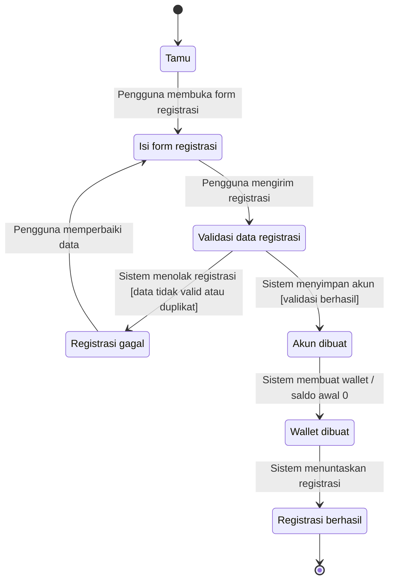

## 2. Autentikasi dan sesi login

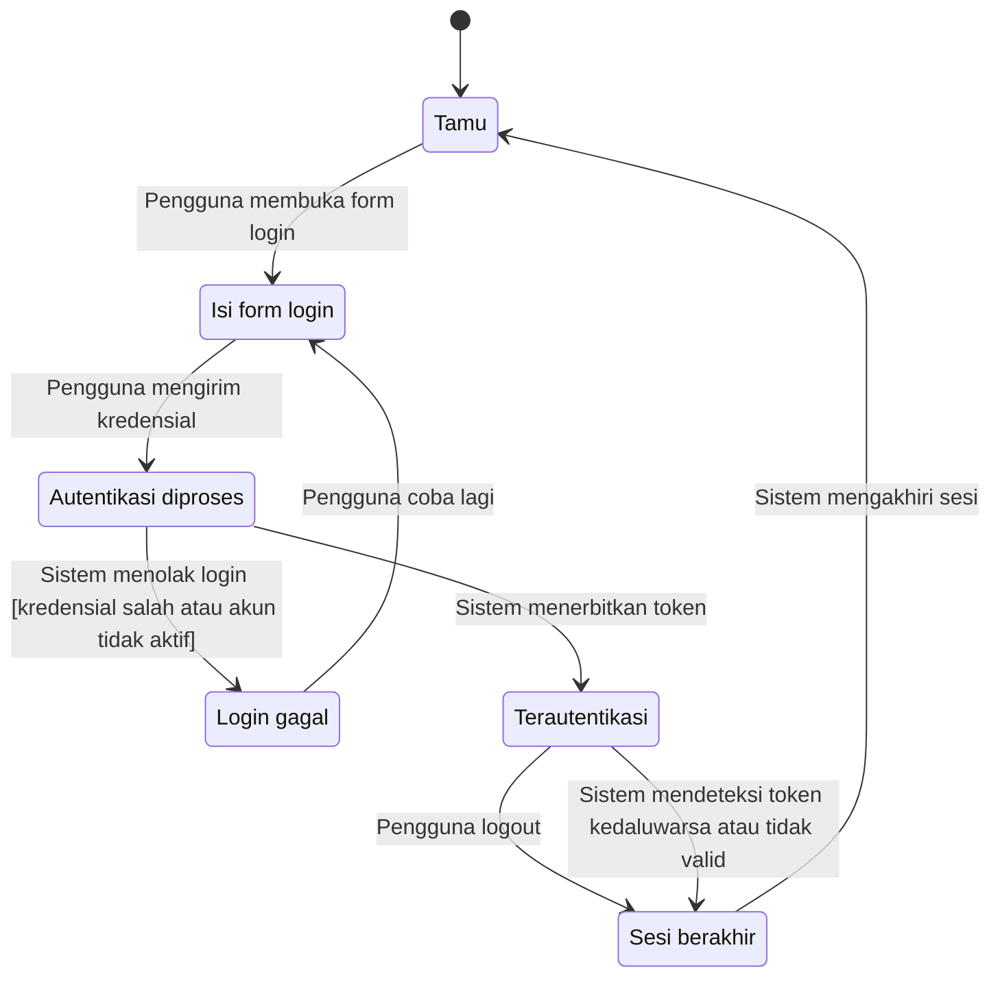

Catatan: pembatasan role terjadi saat mengakses endpoint tertentu. Jika role tidak sesuai, request ditolak (403) tanpa mengubah sesi.

## 3. Siklus hidup akun pengguna

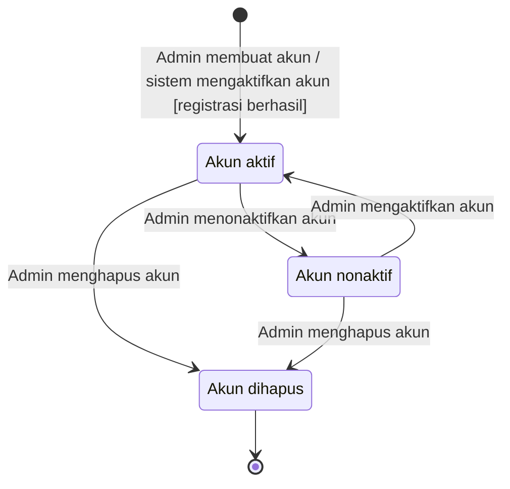

## 4. Siklus hidup akun kurir

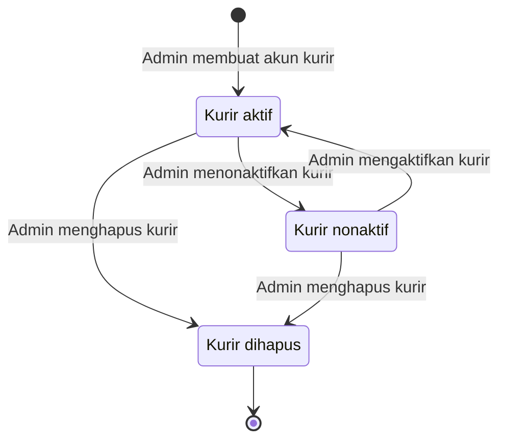

## 5. Siklus hidup listing produk

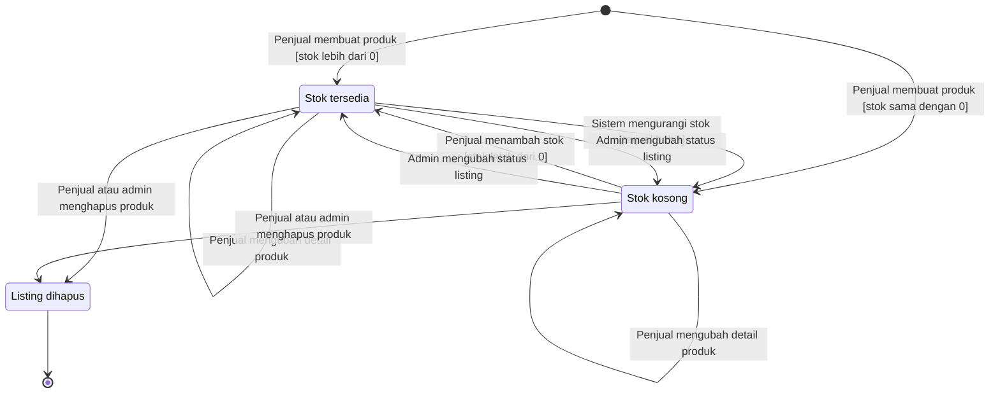

## 6. Keranjang belanja

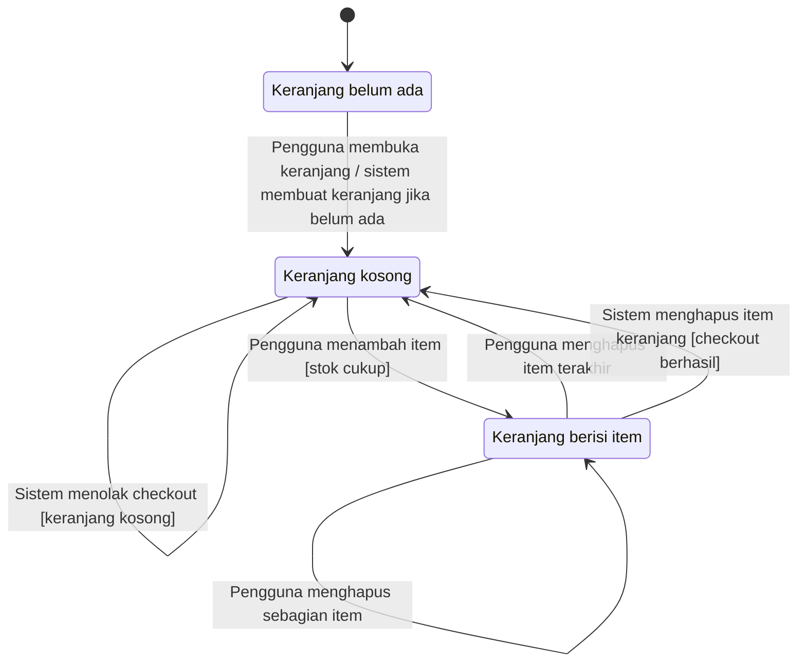

## 7. Proses checkout

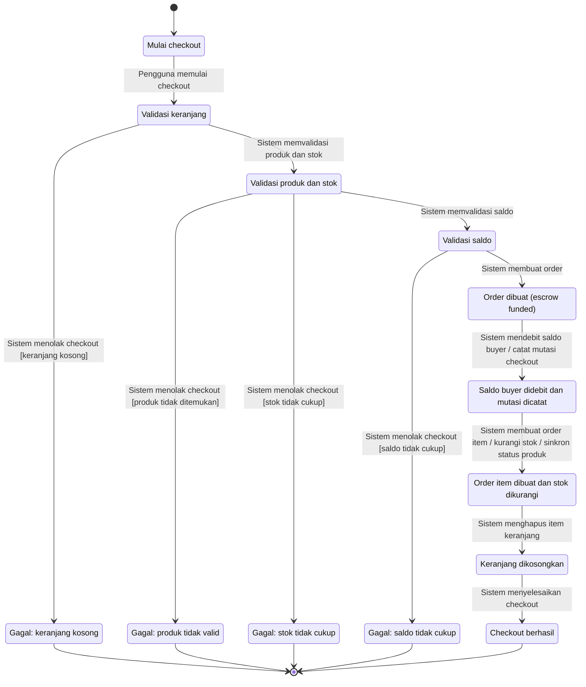

## 8. Status order item (inti alur transaksi)

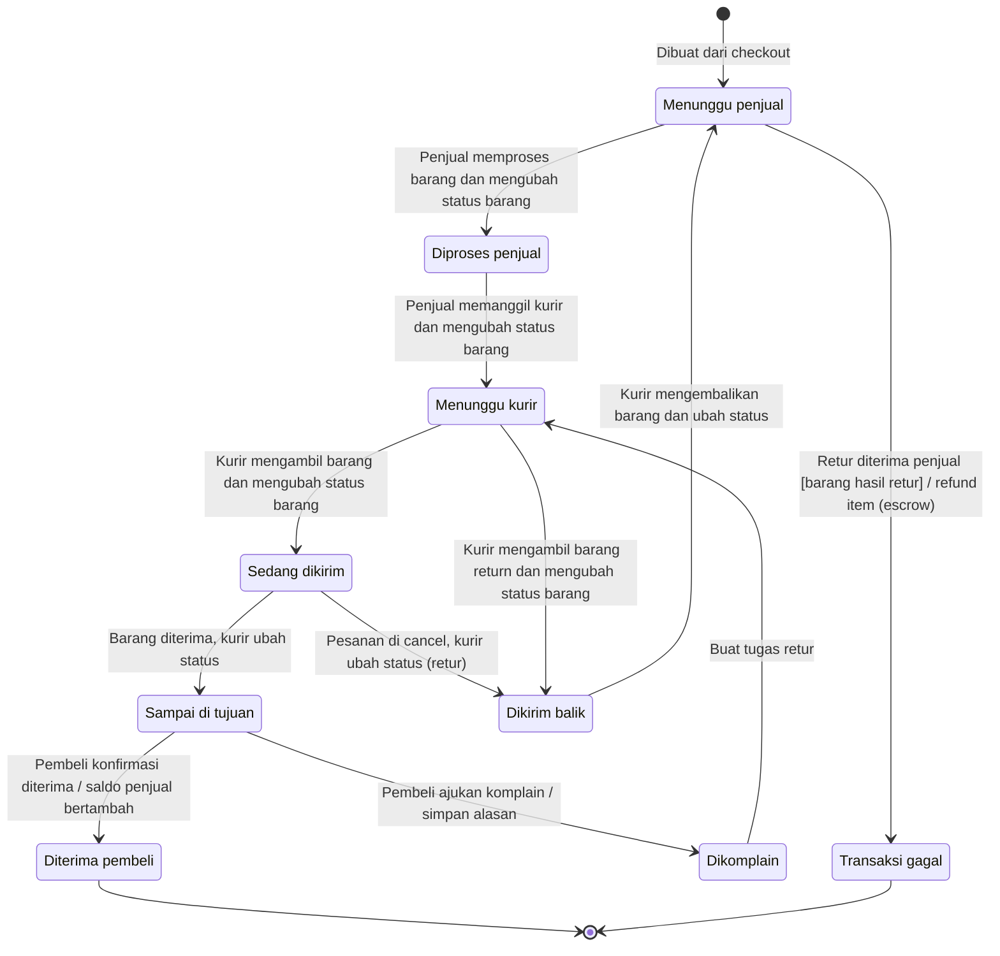

## 9. Status escrow pada order

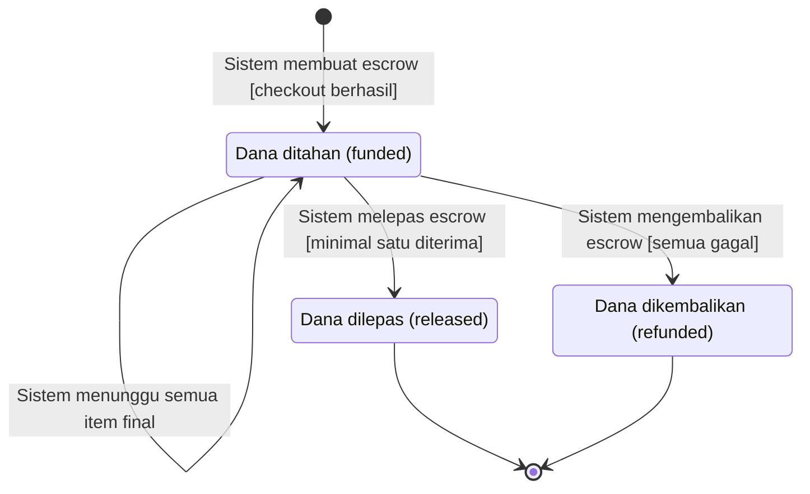

## 10. Wallet saldo (level balance)

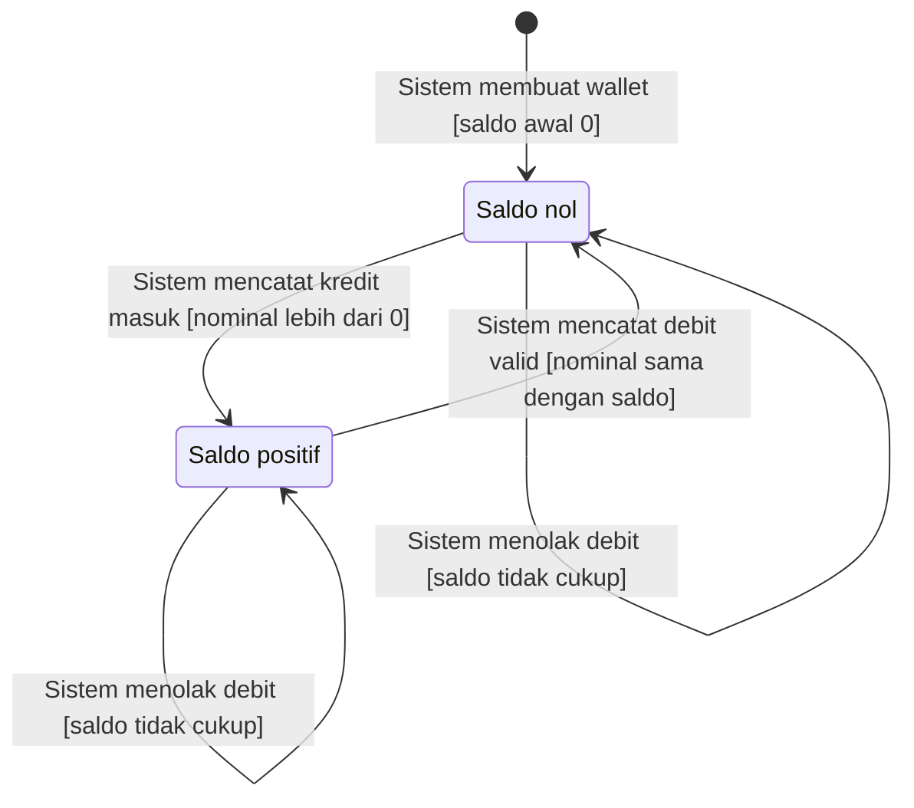

Catatan: diagram wallet saldo tidak memakai end state karena wallet bersifat berkelanjutan selama akun aktif.

## 11. Mutasi wallet manual oleh admin

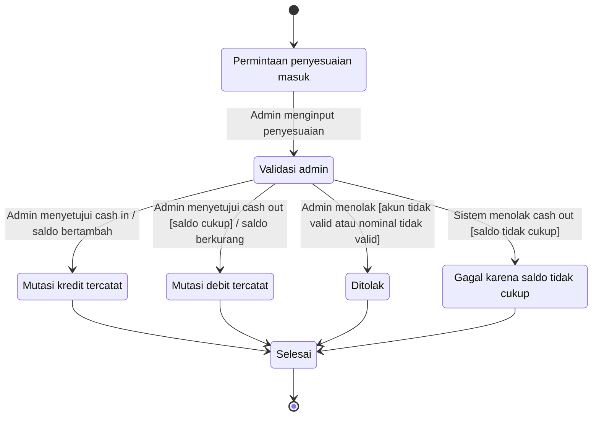

## 12. Intervensi admin pada listing etalase

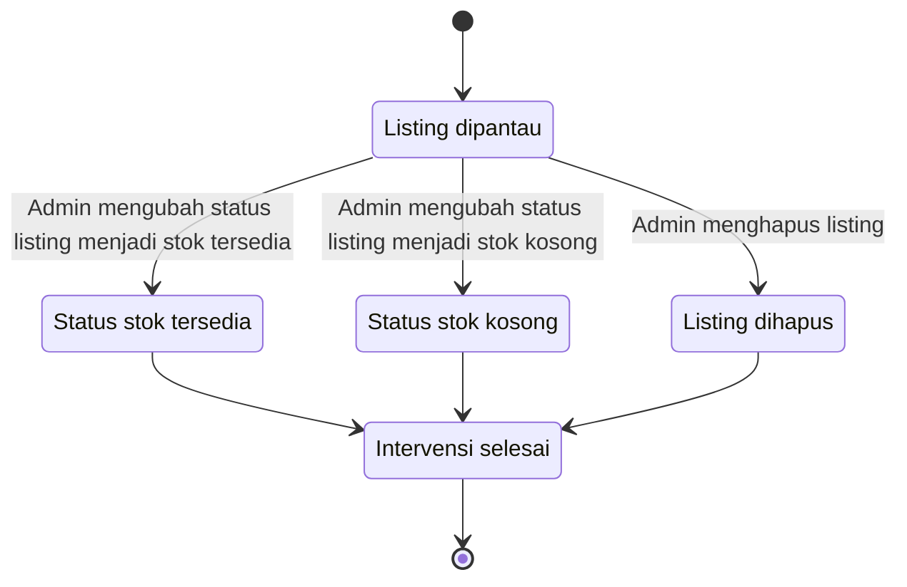

## 13. Alur penanggung jawab tindakan per peran

Diagram ini adalah ringkasan untuk melihat di tahap mana aktor utama biasanya melakukan aksi berikutnya.

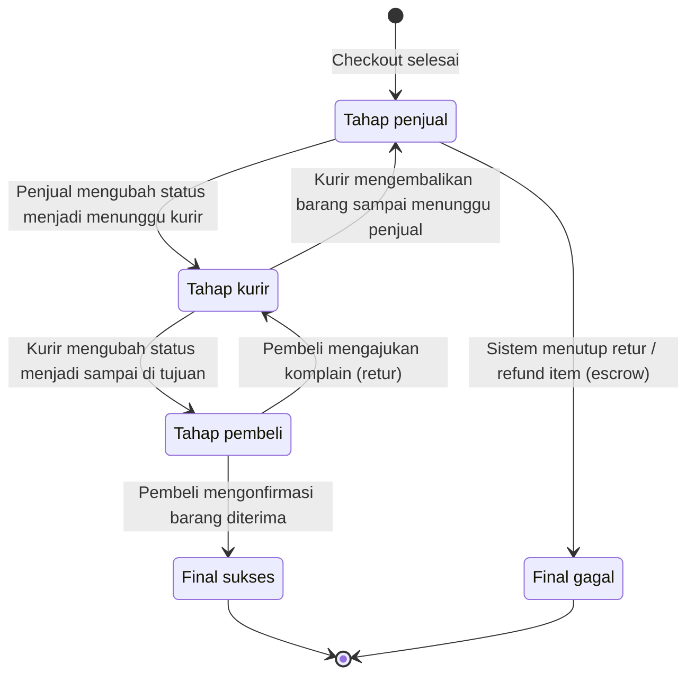

## Catatan penting

1. Diagram 8 (status order item) adalah acuan utama untuk transisi status item.
2. Diagram 9 (escrow) diturunkan dari agregasi status final seluruh item pada satu order.
3. Diagram 10 (wallet saldo) dan 11 (mutasi wallet manual) sengaja dipisah karena fokusnya berbeda:
   - Wallet saldo membahas kondisi nilai saldo saat ini.
   - Mutasi wallet membahas jejak transaksi yang menyebabkan perubahan saldo.
4. Top up dan pencairan uang berada di luar aplikasi web, dan hanya dicatat sebagai penyesuaian manual oleh admin.

## Catatan perbedaan dengan backend saat ini

1. Penetapan kurir tidak memiliki endpoint terpisah. Di backend sekarang, kurir ditetapkan otomatis saat pertama kali kurir mengubah status dari menunggu kurir.
2. Daftar tugas kurir di backend saat ini hanya menampilkan item pada status menunggu kurir, sedang dikirim, dan dikirim balik. Item pada status sampai di tujuan dan dikomplain memang tidak muncul (kurir fokus pada barang yang sedang ditangani).
3. Admin dapat mengubah status listing produk tanpa memeriksa stok, sehingga status dan stok bisa tidak sinkron. Update produk oleh penjual selalu menyinkronkan status mengikuti stok.
4. Alur referensi menyebut bahwa setelah pembeli mengajukan retur, status kembali menjadi menunggu kurir agar kurir bisa melihat tugas penjemputan retur. Backend sekarang menyetel status menjadi dikomplain, sementara daftar tugas kurir tidak menampilkan status dikomplain. Jika ingin 100% sesuai referensi, perlu ada mekanisme untuk membuat status kembali menjadi menunggu kurir setelah komplain.
5. Alur referensi menyebut bahwa retur yang selesai (barang kembali ke penjual) berakhir menjadi transaksi gagal dan refund dilakukan melalui escrow tanpa perubahan status manual oleh admin. Backend sekarang belum mengotomasi finalisasi retur tersebut.
